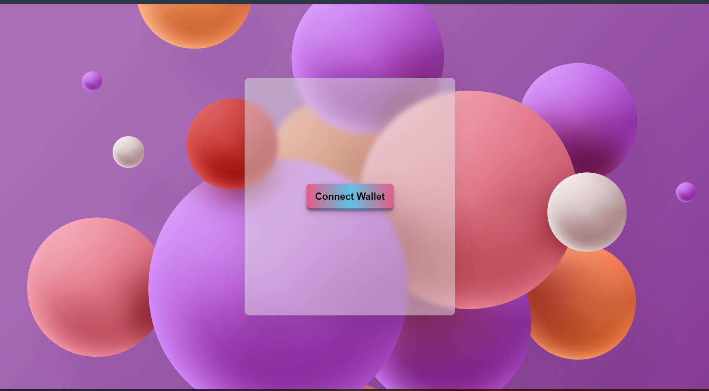

<!-- About the Project -->

# 🪙DANK--Token Project (On Goerli Test network)
This is a custom ERC20Token Faucet. By this you can claim your 100 DANK ERC20 Tokens. Here you can check your balance, also transfer the DANK tokens to others account.

<p align="center">
  
</p>

## Build with🚀
* [Solidity](https://docs.soliditylang.org/)
* [Hardhat](https://hardhat.org/getting-started/)
* [React.js](https://reactjs.org/)
* [ethers.js](https://docs.ethers.io/v5/)

<!-- User Manual -->

## User Manual

### Connect Wallet Page

In this page, you can connect your wallet with your metamask ID. Make sure to choose Goerli test network with some ether in it. If you don't have any goerli ether on your account, you can click this 👉[LINK](https://goerlifaucet.com/)👈 to get some ether for testing. After selecting your address, the custom DANK tokens automatically insert in your account.

<p align="center">
  
</p>

### Faucet Page

This is the main page of this project. If you click the <strong>Gimme gimme</strong> button you can get 100DANK tokens. You can see those DANK tokens on your Metamask Wallet. You can transfer those tokens to another account, or your friends account by the <strong>Transfer</strong> button.
You also check your balance and others too.

<p align="center">
  
</p>

<!-- USER GUIDE -->

## How To Run

### Prerequisites

Please install or have installed the following:
* [nodejs](https://nodejs.org/en/download/) and [npm](https://www.npmjs.com/)
* [MetaMask](https://chrome.google.com/webstore/detail/metamask/nkbihfbeogaeaoehlefnkodbefgpgknn) Chrome extension installed in your browser
* [Hardhat](https://hardhat.org/getting-started/) For scripts and tests


After going through all the installation and setup steps, you'll need to download all the dependencies by running: 
  ```sh
   cd DANK--Token
   npm install
   ```
   This download all the needed dependencies. Then run following : 

   ```sh
   cd SendETH
   npx hardhat run --network localhost .\scripts\deploy.js
   ```
  This will create an artifacts folder into the src folder inside frontend. You have to download all the dependencies inside frontend.

  ```sh
   cd frontend
   npm install
   ```
  To run the frontend
  ```sh
   cd frontend
   npm start
   ```
  Go back to SendETH folder and run following
  ```sh
   cd ..
   npx hardhat node
   ```
  Now for deploy it into goerli network run
  ```sh
   npx hardhat run scripts/deploy.js --network goreli
  ```

## Contributing
Feel free to contribute by sending a PR. 
